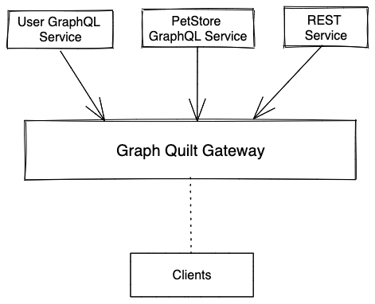

# Graph Quilt 

Graph Quilt is an open architecture for creating a unified graph that aggregates and combines multiple 
GraphQL APIs.

Graph Quilt is a unified API aggregation layer that exposes data from multiple sources through a single
GraphQL endpoint. It aggregates and combines schemas from dynamically registered sources at runtime 
into a single GraphQL schema. It will split all incoming queries into multiple sub-queries, 
orchestrate these sub-queries to appropriate data providers and aggregate providers’ responses into a 
single response before returning it to the client.

